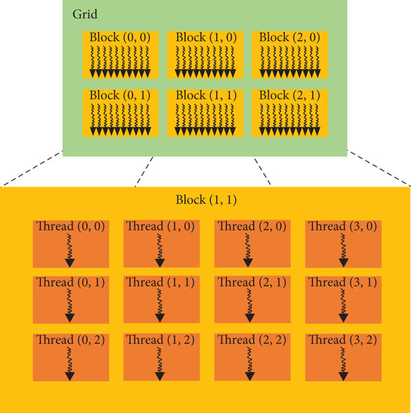

# Introduction au Calcul Haute Performance (HPC) sur GPU

## 1\. Changement de Paradigme : De la Latence au Débit

Pendant des décennies, la loi de Moore a garanti une augmentation régulière de la puissance des processeurs (CPU). L'approche était simple : augmenter la fréquence pour traiter les instructions séquentiellement, mais de plus en plus vite. Le CPU est ainsi devenu un maître de la **logique séquentielle**, optimisé pour minimiser la **latence** (le temps nécessaire pour terminer une tâche).

Cependant, l'avènement des graphismes 3D, et plus récemment du Deep Learning, a imposé une nouvelle contrainte : le besoin de traiter des millions de données identiques simultanément. Face à cette charge, le CPU, avec ses quelques cœurs ultra-complexes, sature.

C'est ici qu'intervient le **GPU (Graphics Processing Unit)**.

### 1.1 Comparaison Architecturale

La différence fondamentale réside dans l'allocation des transistors sur la puce :

  * **Le CPU (Latence) :** Il consacre une énorme partie de sa surface à la mémoire cache et à des unités de contrôle complexes (prédiction de branchement) pour exécuter *une* série d'instructions le plus vite possible.
  * **Le GPU (Débit) :** Il sacrifie cette complexité unitaire au profit de la quantité. Il est composé de milliers de cœurs plus simples, optimisés pour le **débit** (Throughput) : traiter un volume massif d'informations en parallèle.

Pour visualiser cette différence, imaginez que le CPU est une **Ferrari**. Elle est extrêmement rapide pour transporter une personne d'un point A à un point B. Le GPU, en revanche, est un **bus**. Il roule moins vite que la Ferrari, mais il peut transporter 50 personnes d'un coup. Si votre objectif est de déplacer 1 000 personnes (ou 10 millions de pixels), la Ferrari devra faire 1 000 allers-retours, tandis qu'une flotte de bus terminera le travail bien plus tôt.

### 1.2 Le Modèle de Programmation Hétérogène

En CUDA (l'architecture de calcul de NVIDIA), nous adoptons un modèle hétérogène où deux entités collaborent :

1.  **Le Host (CPU) :** C'est le chef d'orchestre. Il gère l'application principale, prépare les données et ordonne les lancements.
2.  **Le Device (GPU) :** C'est le co-processeur de calcul intensif.

Dans le code, cette distinction se fait via le qualifieur `__global__`, qui indique qu'une fonction (appelée **Kernel**) doit être exécutée sur le GPU, mais appelée depuis le CPU.

```cpp
// Fonction exécutée par le GPU (Kernel)
__global__ void monKernel(float* data) {
    // Ce code sera exécuté simultanément par des milliers de threads
}

// Fonction exécutée par le CPU
void main() {
    monKernel<<<...>>>(...); // Appel du Kernel
}
```


## 2\. Architecture Matérielle et Hiérarchie des Threads

Pour gérer des millions de threads sans chaos, CUDA impose une hiérarchie stricte. Comprendre cette structure est vital, car elle correspond directement à l'architecture physique du GPU.

### 2.1 Grille, Blocs et Threads

L'exécution est divisée en trois niveaux logiques :

1.  **La Grille (Grid) :** Elle représente l'ensemble du problème (par exemple, la taille totale d'une image).
2.  **Le Bloc (Block) :** La grille est découpée en tuiles appelées blocs. C'est une unité cruciale car les threads d'un même bloc peuvent coopérer via une mémoire partagée très rapide.
3.  **Le Thread :** C'est l'unité fondamentale de calcul.

 


Prenons l'analogie d'une **université** (la Grille) un jour d'examen. L'université est divisée en plusieurs **amphithéâtres** (les Blocs). Dans chaque amphithéâtre, nous avons des centaines d'**étudiants** (les Threads).

  * L'examinateur (le Host) distribue le même sujet d'examen à toute l'université.
  * Chaque étudiant travaille sur sa propre copie.
  * Les étudiants d'un même amphi peuvent chuchoter entre eux (mémoire partagée du bloc), mais ne peuvent pas parler aux étudiants de l'amphi voisin.

### 2.2 Calcul des Coordonnées

Puisque tous les threads exécutent le même code, comment savent-ils quelle donnée traiter ? Chaque thread doit calculer ses coordonnées uniques $(x, y)$ en utilisant des variables intrinsèques fournies par CUDA :

  * `blockIdx` : La position de mon bloc dans la grille (Quel amphi ?).
  * `blockDim` : La dimension d'un bloc (Combien de places dans l'amphi ?).
  * `threadIdx` : La position du thread dans le bloc (Quel numéro de siège ?).

La formule universelle pour retrouver sa position globale est :
$$GlobalID = (BlockID \times BlockDim) + ThreadID$$


## 3\. Le Goulot d'Étranglement : La Mémoire

C'est souvent ici que les débutants échouent à optimiser leur code. Sur GPU, le facteur limitant est rarement la vitesse de calcul, mais le déplacement des données.

Le CPU et le GPU possèdent des espaces mémoires physiquement séparés (RAM vs VRAM), reliés par le bus **PCI Express (PCIe)**.
Comparé à la vitesse interne du GPU, le bus PCIe est extrêmement lent. On peut le comparer à une petite route départementale reliant deux autoroutes.

**Règle d'or de l'optimisation :** Minimisez les transferts entre le Host et le Device.
La stratégie gagnante consiste à :

1.  Envoyer toutes les données nécessaires sur le GPU en une seule fois (Batching).
2.  Laisser le GPU effectuer le maximum de calculs sans interruption.
3.  Ne récupérer que le résultat final.

Il vaut mieux lancer un calcul complexe sur le GPU (même s'il est un peu lent) plutôt que de faire des allers-retours incessants par le bus PCIe pour des calculs simples.

-----

## 4\. Étude de Cas : Filtre Sépia et Linéarisation Mémoire

Appliquons ces concepts à un cas concret : transformer une image en Sépia. C'est un problème "embarrassingly parallel" car chaque pixel peut être calculé indépendamment des autres.

### 4.1 Le Défi de la Mémoire 1D

Une image est conceptuellement une grille 2D (hauteur $\times$ largeur). Cependant, la mémoire de l'ordinateur est linéaire (1D), comme un long ruban.
Pour accéder au pixel aux coordonnées $(x, y)$, le thread doit projeter ses coordonnées 2D vers un index 1D :

$$Index_{1D} = (y \times Largeur) + x$$

Ensuite, comme chaque pixel couleur est composé de 3 valeurs (Rouge, Vert, Bleu), l'adresse mémoire réelle est multipliée par 3 (ou 4 si transparence).

### 4.2 Implémentation du Kernel

Voici comment le concept se traduit en code. Notez l'absence de boucles `for` : le parallélisme remplace l'itération.

```cpp
__global__ void sepiaKernel(unsigned char* image, int width, int height) {
    // 1. Calcul de la position 2D du thread
    int x = blockIdx.x * blockDim.x + threadIdx.x;
    int y = blockIdx.y * blockDim.y + threadIdx.y;

    // 2. Vérification des limites (Guard clause)
    // Nécessaire car la taille de grille est souvent un multiple de la taille de bloc,
    // ce qui peut dépasser légèrement la taille de l'image.
    if (x < width && y < height) {

        // 3. Mapping vers la mémoire linéaire
        int tid = (y * width + x) * 3;

        // Lecture des composantes RGB
        float r = image[tid];
        float g = image[tid+1];
        float b = image[tid+2];

        // Application de la formule Sépia (Calcul Intensif)
        // Note : fminf assure qu'on ne dépasse pas la valeur 255
        image[tid]   = (unsigned char)fminf(255.0f, (r * 0.393f) + (g * 0.769f) + (b * 0.189f));
        image[tid+1] = (unsigned char)fminf(255.0f, (r * 0.349f) + (g * 0.686f) + (b * 0.168f));
        image[tid+2] = (unsigned char)fminf(255.0f, (r * 0.272f) + (g * 0.534f) + (b * 0.131f));
    }
}
```

### 4.3 Compilation et Lancement

Pour tester cette implémentation, nous utilisons le fichier `code.cu` fourni avec ce cours. Ce fichier ne peut pas être compilé avec les outils standards : il nécessite **NVCC** (NVIDIA CUDA Compiler), le compilateur dédié de NVIDIA.

Voici les commandes à exécuter dans votre environnement (par exemple Google Colab) :

```bash
# 1. Compilation optimisée pour l'architecture T4 (sm_75)
!nvcc -arch=sm_75 -O3 code.cu -o code

# 2. Exécution du programme
!./code
```


### 4.4 Résultats et Analyse

Sur un test réalisé avec une image 4K ($3840 \times 2160$ pixels) sur un GPU standard (Google Collab T4 GPU), les résultats illustrent la puissance du parallélisme :

| Métrique | CPU (Séquentiel) | GPU (Parallèle) |
| :--- | :--- | :--- |
| **Temps Total** | 8 125 ms | 49 ms |
| **Temps par Image** | \~81 ms | \~0.5 ms |
| **Débit** | \~0.1 Gigapixels/s | \~16.9 Gigapixels/s |

Le facteur d'accélération (Speedup) est de **$\times 160$**.
Ce gain phénoménal ne vient pas du fait que le GPU "calcule plus vite" (ses cœurs sont individuellement plus lents que ceux du CPU), mais du fait qu'il a lancé plus de 8 millions de threads simultanément, traitant l'image entière en un seul cycle d'horloge global.


## 5. Conclusion : Vers la Pensée Parallèle
Le GPU se définit comme un processeur massivement parallèle composé de milliers de cœurs simplifiés, piloté par l'architecture logicielle CUDA pour effectuer du calcul intensif. Cependant, cette technologie ne se résume pas à une simple accélération matérielle : elle implique un changement profond de méthode.

Alors que le CPU privilégie la rapidité d'exécution d'une tâche unique (latence), le GPU favorise le traitement simultané de grands volumes de données (débit). Maîtriser CUDA exige donc d'abandonner la logique séquentielle des boucles pour adopter une approche "spatiale", en mappant le problème sur une grille de threads. La performance finale dépendra alors de la capacité du développeur à saturer ces unités de calcul, tout en minimisant les transferts mémoire via le bus PCIe qui reste le principal goulot d'étranglement.